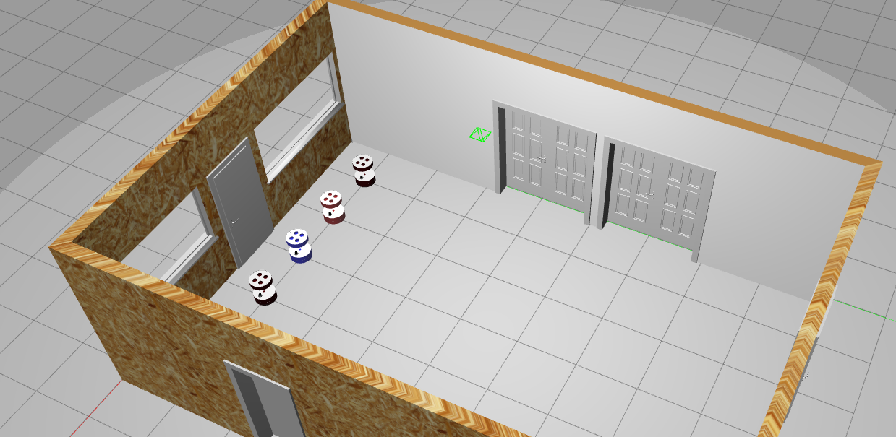

# Multi Robot Simulator for SwarmBot 


## Mapping the environment
Use only one robot to map the area and one need to do it only once. 
```
ros2 launch barista_gazebo main_one_robots.launch.xml

ros2 launch cartographer_slam cartographer.launch.py

ros2 run teleop_twist_keyboard teleop_twist_keyboard cmd_vel:=barista_1/cmd_vel

```
## Save maps after creating maps using cartographer_slam
````
ros2 run nav2_map_server map_saver_cli -f empty_room
````

## 1. Bringup the multirobot simulation, Localization and Pathplanning
````
ros2 launch multirobot_bringup multirobot_bringup.launch.xml
````
## 2. Send pallet pose from rviz2
````
ros2 run multirobot_navigation compute_pallet_pose
````
## 3. Single command to bringup entire simulation

````
ros2 launch multirobot_bringup simulation_bringup.launch.xml
````

### To perform Localization error experiments
1. Run the launch files in 1 and 2.
2. Select 2D Goal Pose on the rviz and choose a pose and wait for the robot navigation to complete.
3. Repeat the experiment by selecting multiple pose within the map.